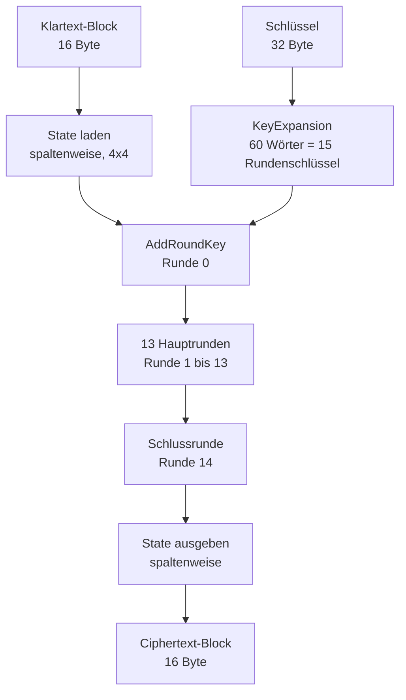
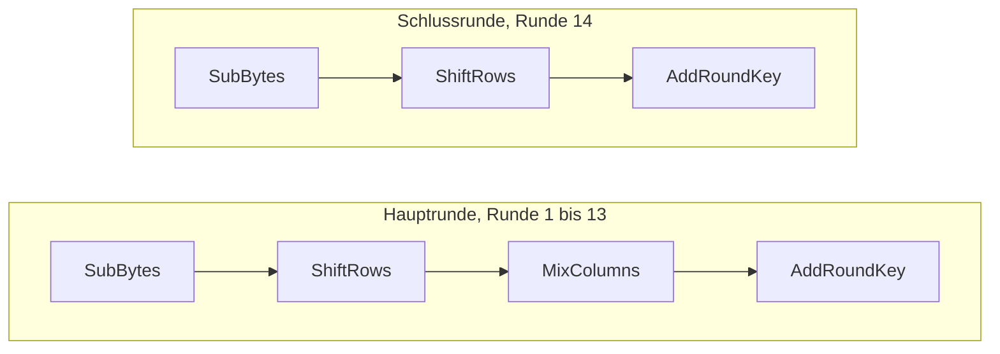
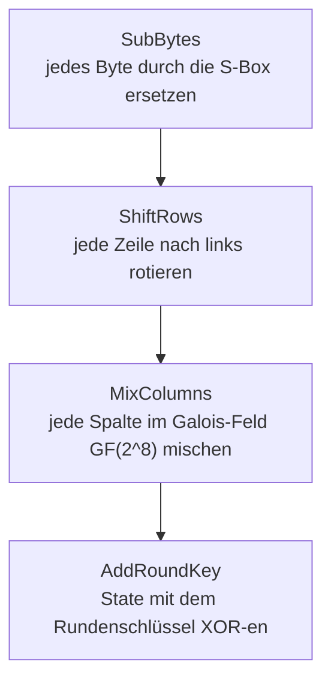
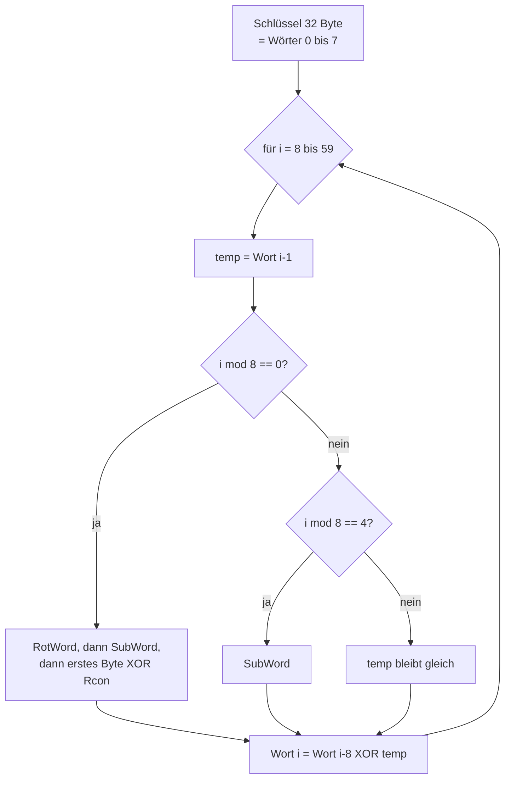

# AES-256 — Ablauf (visuell)

Diese Diagramme zeigen den Ablauf der AES-256-Verschlüsselung eines 16-Byte-Blocks, genau so wie er im Code in `Aes256.EncryptBlock` umgesetzt ist. Gedacht für die Präsentation.

## Gesamtablauf

## Hauptrunde und Schlussrunde im Vergleich

Der einzige Unterschied: die Schlussrunde hat **kein MixColumns**.

## Was die vier Operationen tun

## Schlüsselexpansion

