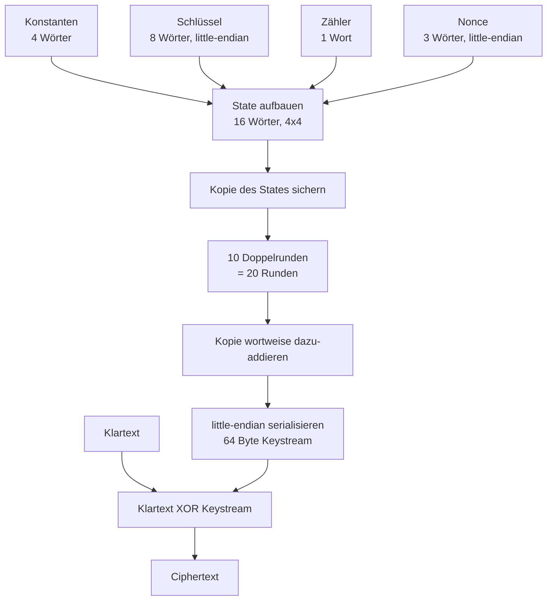
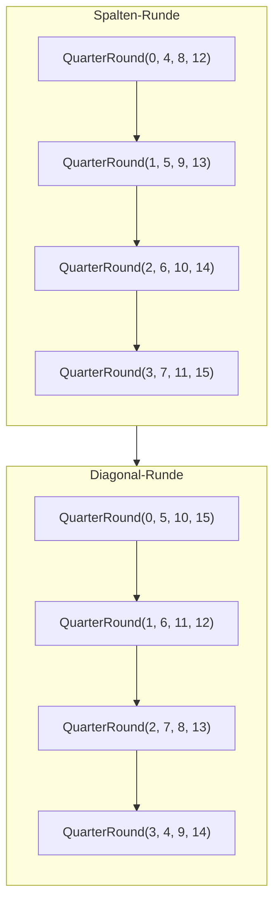
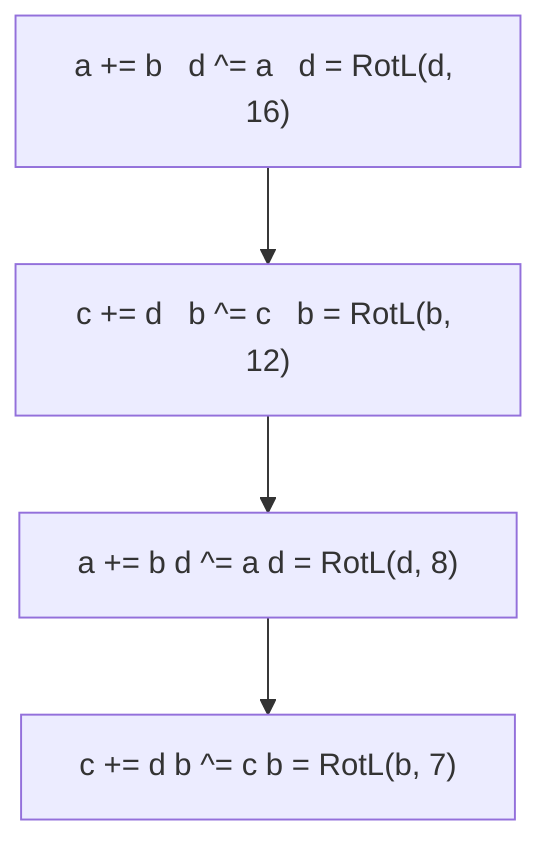

# ChaCha20 — Ablauf (visuell)

Diese Diagramme zeigen den Ablauf von ChaCha20, so wie er im Code umgesetzt ist. Gedacht für die Präsentation.

## Gesamtablauf

## Eine Doppelrunde

Diese Doppelrunde wird 10-mal wiederholt, das ergibt die 20 Runden.

## Die Quarter-Round (ARX)

Nur Addition mod 2^32, XOR und Rotation nach links. Kein Galois-Feld, keine Tabellen. Das ist der ganze Trick von ChaCha20.
